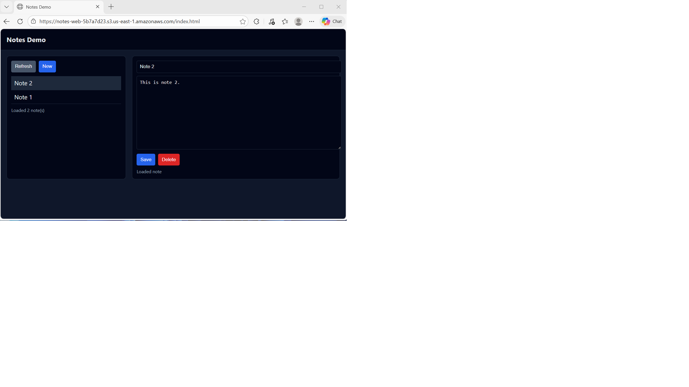
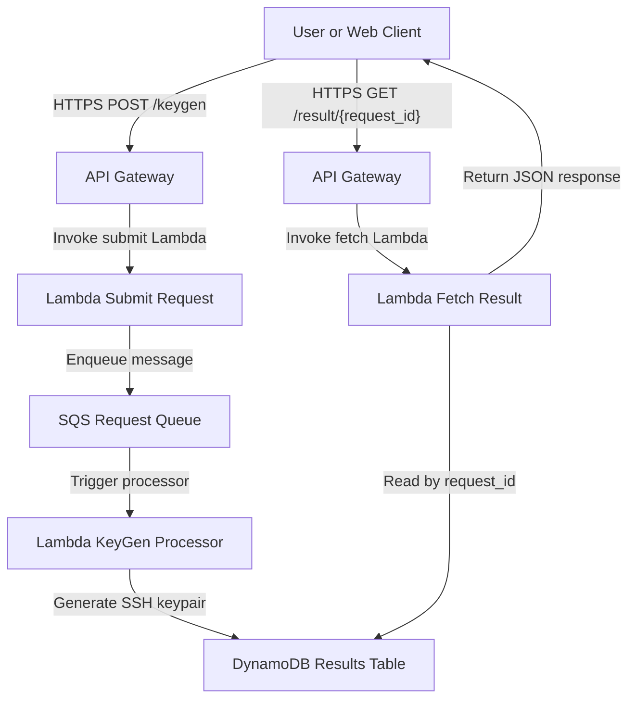

# AWS Serverless CRUD API with Lambda, DynamoDB, and API Gateway

This project delivers a fully automated **serverless CRUD (Create, Read, Update,
Delete) API** on AWS, built using **Amazon API Gateway**, **AWS Lambda**, and
**Amazon DynamoDB**.

It uses **Terraform** and **Python (boto3)** to provision and deploy a
**stateless, REST-style backend** that exposes HTTP endpoints for managing simple
“notes” data — all without running or managing any EC2 instances.

For testing and demonstration purposes, a lightweight **HTML web frontend**
interacts directly with the deployed API, allowing users to create, view, update,
and delete notes from a browser.



This design follows a **serverless microservice architecture** where API Gateway
routes requests to dedicated Lambda functions, DynamoDB provides fully managed
persistence, and AWS handles scaling, availability, and fault tolerance
automatically.

Key capabilities demonstrated:

1. **Serverless CRUD API** – Implements REST-style endpoints backed by Lambda
   functions for creating, retrieving, listing, updating, and deleting records.
2. **Stateless Compute Layer** – Each Lambda function is independent and
   stateless, enabling horizontal scaling and zero idle cost.
3. **Managed NoSQL Storage** – Uses DynamoDB with on-demand capacity for
   low-latency, fully managed data persistence.
4. **Infrastructure as Code (IaC)** – Terraform provisions API Gateway routes,
   Lambda functions, IAM roles, DynamoDB tables, and supporting resources in a
   repeatable, auditable way.
5. **Browser-Based Test Client** – A simple static HTML frontend demonstrates
   real-time interaction with the API without requiring additional tooling.

Together, these components form a **clean, minimal reference architecture** for
building serverless APIs on AWS — suitable for learning, prototyping, or extending
into more advanced event-driven and authenticated microservices.


## API Gateway Endpoints

The **KeyGen API** exposes two HTTP endpoints through **Amazon API Gateway (HTTP API)**, providing
a simple request/response workflow for asynchronous SSH key generation.  
All endpoints return structured JSON and are designed to integrate seamlessly with both CLI and
browser-based clients.

### POST /keygen

**Purpose:**  
Submits a new SSH key generation request to the service.  
The request is placed on the SQS queue and processed asynchronously by the Lambda function.

**Request Body (JSON):**
```json
{
  "key_type": "rsa",
  "key_bits": 2048
}
```

**Parameters:**
| Field | Type | Required | Description |
|-------|------|-----------|-------------|
| `key_type` | string | No | Type of key to generate (`rsa` or `ed25519`). Defaults to `rsa`. |
| `key_bits` | integer | No | RSA key size (`2048` or `4096`). Ignored for Ed25519 keys. |

**Example Request:**
```bash
curl -X POST https://<api-id>.execute-api.us-east-1.amazonaws.com/keygen   -H "Content-Type: application/json"   -d '{"key_type": "rsa", "key_bits": 2048}'
```

**Example Response:**
```json
{
  "request_id": "630f70c4-815c-41d1-ae52-6babf3a41b1f",
  "status": "submitted"
}
```

**Behavior:**
- The API immediately returns a unique `request_id` for correlation.  
- The actual key generation occurs asynchronously in the Lambda worker.  
- Clients must poll the `/result/{request_id}` endpoint to retrieve the final output.

### GET /result/{request_id}

**Purpose:**  
Retrieves the result of a previously submitted SSH key generation request.

**Path Parameters:**
| Parameter | Type | Description |
|------------|------|-------------|
| `request_id` | string | Unique ID returned by the `/keygen` call. |

**Example Request:**
```bash
curl https://<api-id>.execute-api.us-east-1.amazonaws.com/result/630f70c4-815c-41d1-ae52-6babf3a41b1f
```

**Example Response (Pending):**
```json
{
  "request_id": "630f70c4-815c-41d1-ae52-6babf3a41b1f",
  "status": "pending"
}
```

**Example Response (Completed):**
```json
{
  "request_id": "630f70c4-815c-41d1-ae52-6babf3a41b1f",
  "status": "complete",
  "key_type": "rsa",
  "key_bits": 2048,
  "public_key_b64": "LS0tLS1CRUdJTiBSU0EgUFVCTElDIEtFWS0tLS0t...",
  "private_key_b64": "LS0tLS1CRUdJTiBSU0EgUFJJVkFURSBLRVktLS0tLQo..."
}
```

**Status Values:**
| Status | Description |
|---------|--------------|
| `submitted` | Request accepted and queued for processing. |
| `pending` | Request is being processed by the Lambda worker. |
| `complete` | Key generation successful; keypair included in response. |
| `error` | Request failed; additional error message provided. |

---

**Notes:**
- Responses are served directly by Lambda via API Gateway, backed by DynamoDB or SQS polling.  
- Keys are base64-encoded to ensure transport safety and can be decoded to PEM format for local use.  
- No state is persisted beyond queue message lifetime, ensuring security and cost efficiency.

### Architecture Flow



## Prerequisites

* [An AWS Account](https://aws.amazon.com/console/)
* [Install AWS CLI](https://docs.aws.amazon.com/cli/latest/userguide/getting-started-install.html)
* [Install Terraform](https://developer.hashicorp.com/terraform/install)
* [Install Docker](https://docs.docker.com/engine/install)

If this is your first time following along, we recommend starting with this video:  
**[AWS + Terraform: Easy Setup](https://www.youtube.com/watch?v=9clW3VQLyxA)** – it walks through configuring your AWS credentials, Terraform backend, and CLI environment.

## Download this Repository

```bash
git clone https://github.com/mamonaco1973/aws-sqs-keygen.git
cd aws-sqs-keygen
```

## Build the Code

Run [check_env](check_env.sh) to validate your environment, then run [apply](apply.sh) to provision the infrastructure.

```bash
~/aws-sqs-keygen$ ./apply.sh
NOTE: Running environment validation...
NOTE: Validating that required commands are found in your PATH.
NOTE: aws is found in the current PATH.
NOTE: terraform is found in the current PATH.
NOTE: docker is found in the current PATH.
NOTE: jq is found in the current PATH.
NOTE: All required commands are available.
NOTE: Checking AWS cli connection.
NOTE: Successfully logged into AWS.
NOTE: Building Active Directory instance...
Initializing the backend...
```

### Build Results

When the deployment completes, the following resources are created:

- **Core Infrastructure:**  
  - Fully serverless architecture—no EC2 instances or VPC networking required  
  - Terraform-managed provisioning of SQS, Lambda, API Gateway, DynamoDB, ECR, and S3 resources  
  - Event-driven message pipeline enabling asynchronous SSH key generation requests and result retrieval  

- **Security & IAM:**  
  - IAM roles for Lambda execution with scoped permissions for SQS, DynamoDB, CloudWatch, and Secrets Manager  
  - Optional encryption of SQS queues and DynamoDB tables using AWS-managed KMS keys  
  - Secure handling of generated SSH keys entirely in-memory—no local file storage or persistence  

- **Amazon SQS Queue:**  
  - Dedicated request queue (`keygen-request`) for incoming SSH key generation jobs  
  - Receives messages from API Gateway or CLI clients, decoupling request submission from processing  
  - Ensures durability and automatic retry handling for transient Lambda invocation failures  

- **Amazon DynamoDB Table:**  
  - Central result store keyed by unique `request_id`  
  - Lambda writes key generation results to DynamoDB after successful processing  
  - Each record includes metadata (status, key_type, key_bits) and base64-encoded keypair data  
  - Configured with Time-to-Live (TTL) for automatic expiration and cost efficiency  

- **AWS Lambda Function:**  
  - Python-based Lambda built from a custom Docker image hosted in Amazon ECR  
  - Asynchronously consumes requests from the SQS queue, generates SSH keypairs, and writes results to DynamoDB  
  - Supports RSA-2048, RSA-4096, and Ed25519 key types configurable through API payload parameters  
  - Emits structured logs and metrics to CloudWatch for observability and debugging  

- **Amazon API Gateway:**  
  - HTTP API exposing `/request` and `/result/{request_id}` endpoints  
  - Integrates directly with Lambda functions to submit new jobs and query DynamoDB for completed results  
  - Provides stateless, secure HTTPS access for browser clients or programmatic integrations  

- **Amazon ECR:**  
  - Private ECR repository (`ssh-keygen`) storing the Lambda container image  
  - Automated vulnerability scanning enabled for enhanced security visibility  
  - Acts as the Lambda image source during Terraform deployment  

- **Static Web Application (S3):**  
  - S3 bucket configured for static website hosting with public read access through a managed bucket policy  
  - `index.html` provides a simple frontend allowing users to select key type and initiate generation requests  
  - Dynamically calls the API Gateway endpoints published as Terraform outputs  

- **Automation & Validation:**  
  - `apply.sh`, `destroy.sh`, and `check_env.sh` scripts automate provisioning, teardown, and environment validation  
  - `validate.sh` performs end-to-end verification by invoking the API, polling for results, and confirming DynamoDB output  
  - Entire workflow runs with AWS credentials, Docker, Terraform, and jq—no manual resource setup required  

Together, these resources form a **serverless, event-driven SSH KeyGen pipeline** that demonstrates modern AWS microservice design principles—scalable, cost-efficient, and fully managed from infrastructure to code.


